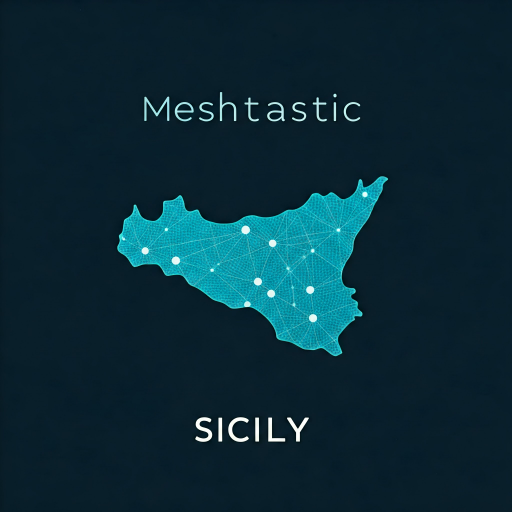

<!-- PROJECT LOGO -->
 

  

  <h3 align="center">
    Meshtastic Sicily Community
    </h3>
  

    A community of people who use Meshtastic in Sicily.
     
     
    <a href="https://t.me/meshtastic_sicily">Join the community</a>
    ·
    <a href="https://github.com/Matt0550/Meshtastic-Sicily/issues">Report Bug</a>
    ·
    <a href="https://github.com/Matt0550/Meshtastic-Sicily/issues">Request Feature</a>
  

#  About Meshtastic

Meshtastic is a project that allows you to create a mesh network with LoRa devices. It is based on the ESP32 microcontroller and the SX1276 LoRa module. The project is [open source](https://meshtastic.org/).

# About Meshtastic Sicily

Meshtastic Sicily is a community of people who use Meshtastic in Sicily or who want to contribute to the project. To get in touch with the community, you can join the [Telegram group](https://t.me/meshtastic_sicily).

## Map

Meshtastic Sicily has a map where you can see the position of the devices of the community members. You can access the map at the following link: 
[Meshtastic Sicily Map](https://meshtastic-sicily.matt05.it/).

The map is still in development and needs to be improved (like implementing APIs, adding more features, etc.).

### How to add your device to the map

To add your device to the map, you need to follow these steps:
- Create a new issue on this repository by clicking on the "Issues" tab and then on the "New issue" button.
- Use the "Add device to the map" template.

# LoRaItalia Community

Meshtastic Sicily is inspired by the [LoRaItalia](https://www.loraitalia.it/) community. LoRaItalia is a community of people who use LoRa devices in Italy. The community has also a [map](https://map.loraitalia.it/).
# Help - feedback

If you need help or want to give feedback, you can create a new issue by clicking on the "Issues" tab and then on the "New issue" button.

Otherwise, you can join the [Telegram group](https://t.me/meshtastic_sicily) and ask for help or give feedback.

# License

[MIT](https://choosealicense.com/licenses/mit/)

